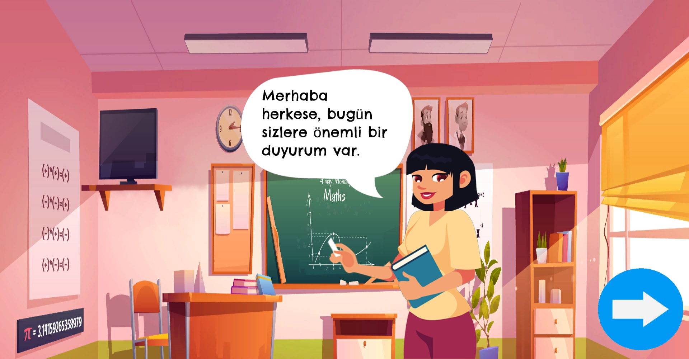
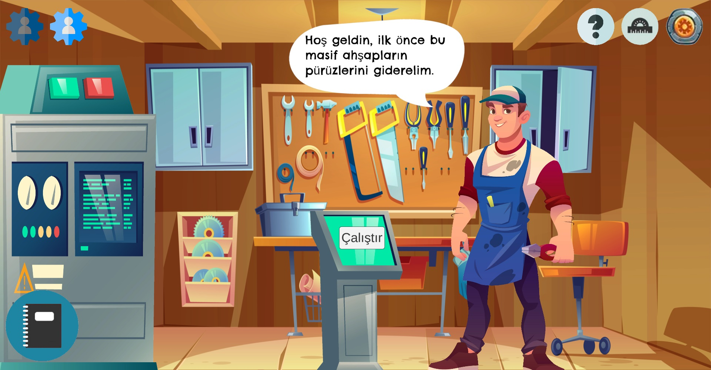
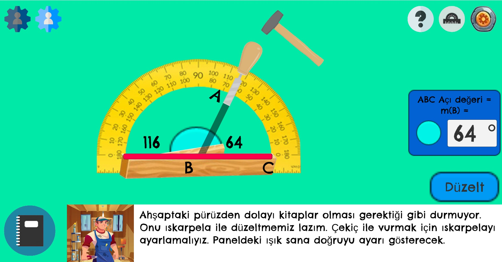
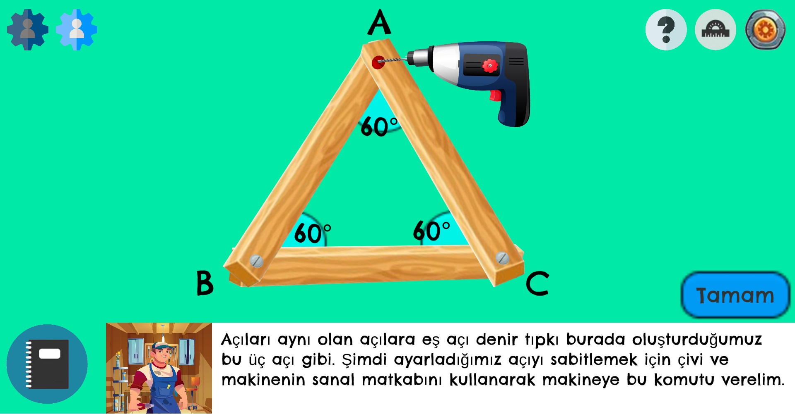

    
# Atolye

    
   

    

    

The workshop game is an educational game that will help students who have problems with Turkey MEB 6th grade Mathematics Angles and Area Measurement.

You can play it from this website = https://alierenkayhan.itch.io/atlye
 
 

## Table of Contents

* [General Info](#Atolye)
* [Technologies Used](#Technologies)
* [Prerequisites](#Prerequisites)
* [Features](#Features)
* [Screenshots](#Screenshots)
* [Setup](#Setup)
* [Lisans](#Lisans)
* [Feedback](#Feedback)
* [Reference](#Reference)
 
## Technologies
-  
- 
- 

## Features
1-Features of Atölye   
    - 2D game 
    - Instructional game  
    - Authentic game  
   
## Screenshots
  1-Screenshots of Atölye 
  <table> 
    <tr>
        <td>  
</td>
        <td>  
</td>
    </tr>
    <tr>
        <td>  
</td>
        <td>  
</td>
    </tr>
   </table>

## Setup  
  -Go to the link. 
  -Download the game. 
  -Export it from zip. 
  -Find the file which has with ".exe" extension and open it. 
 
## Lisans

This project is licensed under the terms of the [MIT](https://choosealicense.com/licenses/mit/) license.

  
## Feedback

If you have any feedback, please contact me at ali_erenbatman@hotmail.com.
  
## Reference
    -https://github.com/alexandresanlim/Badges4-README.md-Profile
    -https://shields.io/
